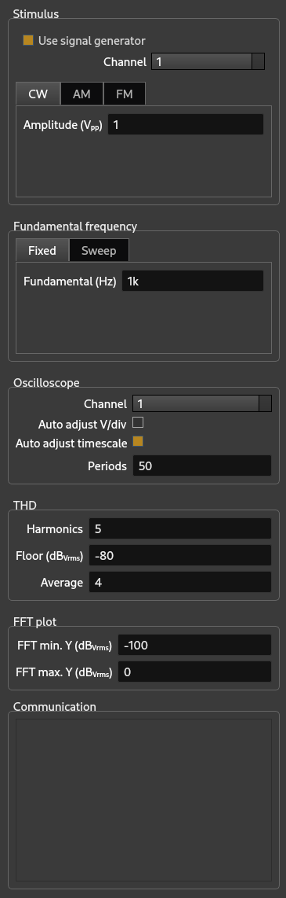

# Yolo
## Automated Distortion Analysis using a signal generator and an oscilloscope

# Usage scenario's

## Scenario 1


In this scenario the output of the signal generator is directly connected to the input of the oscilloscope. It can be used to measure the purity of the signals generated by the signal generator. CW is the only signal generation option which can be used. AM and FM modulation cannot be used, as there is no demodulation stage in the signal chain and Yolo cannot demodulate.


## Scenario 2


In this scenario there is a device (DUT) between the signal generator and the oscilloscope. The DUT trnasforms the signal from the siganl generator in some way. This can be for example amplification, filtering, demodulation. As long as the output from the DUT is a CW signal any device can be used. In this scenario AM and FM modulation can be used in Yolo, as long as the DUT is an appropriate demodulator.


## Scenario 3


In this scenario the CW signal to the oscilloscope comes from an unknown source. Its fundamental frequency should be known. The checkbox 'Use signal generator' in the 'Stimulus' controls section should be unchecked.


# Main window
The main window of Yolo looks like this:


# Views

## Oscilloscope view


The oscilloscope view provides a view of the complete waveform as captured from the oscilloscope. It is live updated. The update speed depends on the sampling rate and the timebase of the oscilloscope. The timescale for the oscilloscope can be set automatically by checking 'Auto adjust timescale' and period in the oscilloscope controls. The value of 'periods' will ensure that minimally this number of periods will be shown in the oscilloscope view, and used for the thd calculations. 


## Zoom view


The zoom view provides a zoomed in view of the oscilloscope view. It shows two periods of the waveform. The period is calculated from the value entered in the controls for the fundamental frequency, be it either the fundamental frequency in fixed operation, or the current frequency in the swept operation.


## FFT view


The FFT view provides a frequency spectrum of the waveform. A Blackman window is used for this FFT spectrum. The FFT spectrum is the basis for the THD calculations. The minimum and maximum values for the y-axis can be entered in 'FFT min. Y' and 'FFT max. Y' in the FFT controls. The FFT is live updated.


## THD view

The THD view has two appearance depending on whether Yolo is running in fixed or in swept operation. See 'Fundamental frequency' controls.


### Fixed operation


In fixed operation the THD calculation is running continuously on one, fixed frequency (which is set in 'Fundamental'). The view shows THD in %, s<sub>0</sub> and s<sub>1</sub> (the fundamental and second harmonic respectively) in dB<sub>V<sub>rms</sub></sub>. The calculations can be averaged over a number of samples (which can be set in 'Average' in the THD controls).

In this mode of operation you can for eample tune a demodulator, or a amplifier to give minimum distortion. Change some component values in your circuit and keep an eye on the THD as displayed in this view.


### Swept operation


This view shows the THD over a range of frequencies as set in 'Minimum frequency' and 'Maximum frequency' in the Sweep section of the Fundamental frequency controls.


# Controls

The controls section is on the right side of the main window.



In all controls where numeric values are needed, the normal units can be used:

1m = 0.001
<br>
1k = 1000
<br>
1M = 1000000
<br>
1.5k = 1500
<br>
etc.

Values of these controls will be saved after each run in ```/home/<user>/.config/FM Homelab/lru_controls.json```. 

Values of these controls will also be saved in a file in the directory as set in the directory in the Settings dialog. The name of this file will be ```<run> controls.json``` where ```<run>``` will be a datetime stamp like ```2025-03-11 20:55:40 ``` to identify the run.

Control values which are saved in a ```controls.json``` file can be loaded and made active by clicking 'File' in the menubar and then 'Load controls...'.


## Stimulus

In the stiumulus controls section you an set various parameters of the signal generator.

The checkbox 'Use signal generator' sets whether to use a signal generator at all. The stimulus may come from another source which is not under control of Yolo.

In 'Channel' you can set which channel will be used on the signal generator.


### CW


The CW tab allows for continuous wave operation, ie. no modulation.


### AM


The AM tab allows for AM modulation. The carrier frequency, the carrier amplitude as well as the modulation depth can be set.

On the Siglent SDG1032X (the only signal generator on which Yolo has been tested) there are limits on the maximum modulation frequency. The maximum modulation frequency cannot be higher than 20kHz.

The modulation frequency is used as the fundamental frequency in the THD calculations.


### FM


The FM tab allows for FM modulation. The carrier frequency, the carrier amplitude as well as the frequency deviation can be set.

On the Siglent SDG1032X (the only signal generator on which Yolo has been tested) there are limits on the maximum modulation frequency. The maximum modulation frequency cannot be higher than 20kHz.

The modulation frequency is used as the fundamental frequency in the THD calculations.


## Fundamental frequency

### Fixed


In fixed operation the CW frequency, or the AM or FM modulation frequency will be kept constant. This frequency is used as the fundamental frequency in the THD calculations.


### Sweep


In swept operation the CW frequency, or the AM or FM modulation frequency will be swept from 'Minimum frequency' to 'Maximum frequency' with steps as set in 'Frequency step'. Note this last setting is not the number of frequency steps, but the frequency stepsize.


## Oscilloscope


In the Oscillope controls section you can set various parameters for the oscilloscope.

In 'Channel' you can set which channel to use.

'Auto adjust V/div' lets Yolo adjust the vertical scale automatically. This will ensure maximum resolution in ampitude determination.

'Auto adjust timescale' lets Yolo adjust the timescale automatically. It does this by ensuring that the oscilloscope captures a minimum number of periods as set in 'Periods'. A larger number of periods allows for better frequency resolution in the FFT plot. A larger number of periods also makes the sampling time larger, so slower opertaion.


## THD


In th THD controls section you set the parameters for the THD calculation. 

In 'Harmonics' you tell Yolo how many harmonics are used to calculate the THD. The fundamental is the first harmonic, so 'Harmonics' must be larger than 1.

'Floor' is the lowest signal level for a harmonic to participate in the THD calculation. Any signal lower than 'Floor' will be ignored.

In 'Average' you can set the number of samples for THD calculation.


## FFT plot


In 'FFT min. Y' and 'FFT max. Y' you can set the minimum and maximum offset of the y- axis in the FFT plot.

The x-axis (frequency axis) of the FFT plot will be calculated automatically by the formula f<sub>0</sub> ∙ n ∙ 1.25 where f<sub>0</sub> is the fundamental frequency and n is the number of harmonics in use for the THD calculation. This way all harmonics which are used will be visible in the FFT plot.


## THD plot


With 'Plot amplitude' you can tell Yolo whether to plot the amplitude of the signal besides the THD. The y-axis for the amplitude will be on the right side of the plot. The line for the amplitude will be dashed.

# Settings

The Settings window can be opened by clicking 'Edit' in the menubar, and then 'Settings'.


It can be used to change system parameters which do not need to be changed after settings up Yolo.

## Signal Generator

In 'IP' and 'Port' you can set the ip address for the signal generator. In 'Query delay' you set the time for Yolo to wait after each command has been sent to the signal generator. It has been noticed that on the Siglent SDG1032X it is necessary to wait 0.5 seconds. If no wait is introduced, the sdg1032x seems to drown in the requests and after some time it stops responding and needs to be restarted.

You can choose to either use pyvisa or pydatacq to communicate with the SDG1032X. Pyvisa uses the VXI-11 protocol to communicate witht the SDG1032X, whereas pydatacq uses plain TCP. The SDG1032X seems to respond to VXI-11 much quicker than to plain TCP.


## Oscilloscope

In 'IP' and 'Port' you can set the ip address for the oscilloscope.


## THD Plotfile

Here you can set the folder in which Yolo will store the
- THD plot files
- THD data files (as .csv files)
- the control values used to obtain these results.


# Requirements

Yolo needs the following packages to run:

engineering-notation 0.10.0
<br>
fft_calculations     0.2.2
<br>
matplotlib           3.10.0
<br>
matplotlib-inline    0.1.6
<br>
numpy                2.2.2
<br>
pydatacq             0.4.5
<br>
PyQt6                6.8.0
<br>
PyQt6-Qt6            6.8.1
<br>
PyQt6_sip            13.9.1
<br>
PySide6              6.8.1.1
<br>
PySide6_Addons       6.8.1.1
<br>
PySide6_Essentials   6.8.1.1
<br>
PyVISA               1.14.1
<br>
PyVISA-py            0.7.2
<br>
qasync               0.27.1
<br>
quantiphy            2.20
<br>
scipy                1.15.1
<br>
uvloop               0.19.0a1
<br>

and runs fine on Python 3.11.11.

Yolo has been tested on:
Fedora Linux 39 (Workstation Edition)
linux kernel version Linux 6.11.9-100.fc39.x86_64
Gnome 45.10

