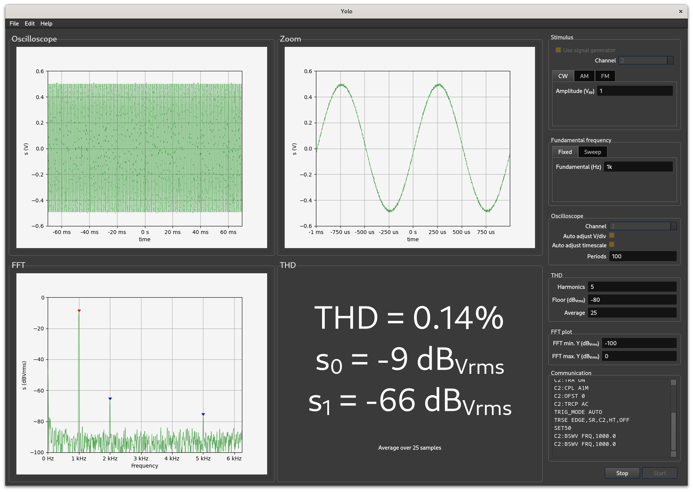
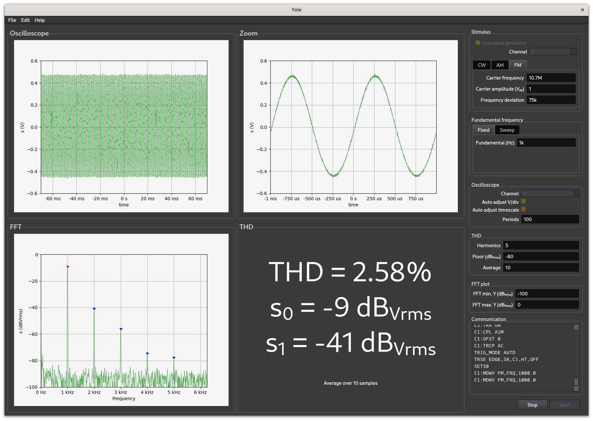
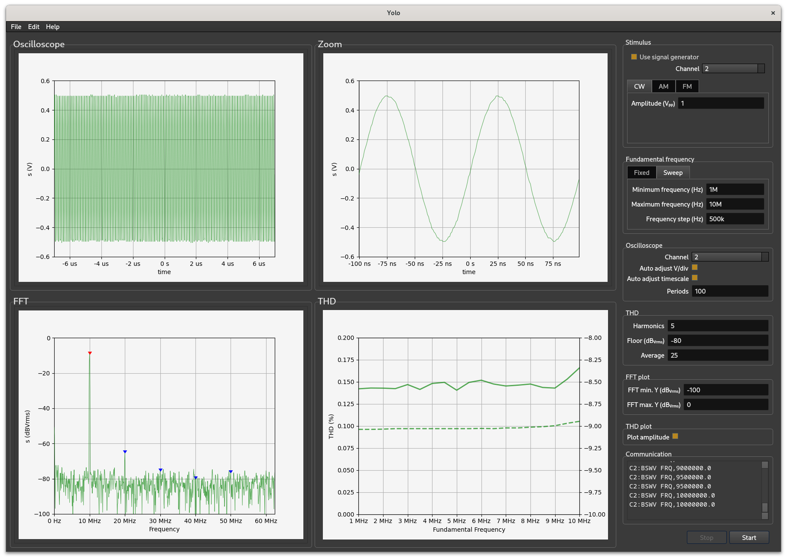
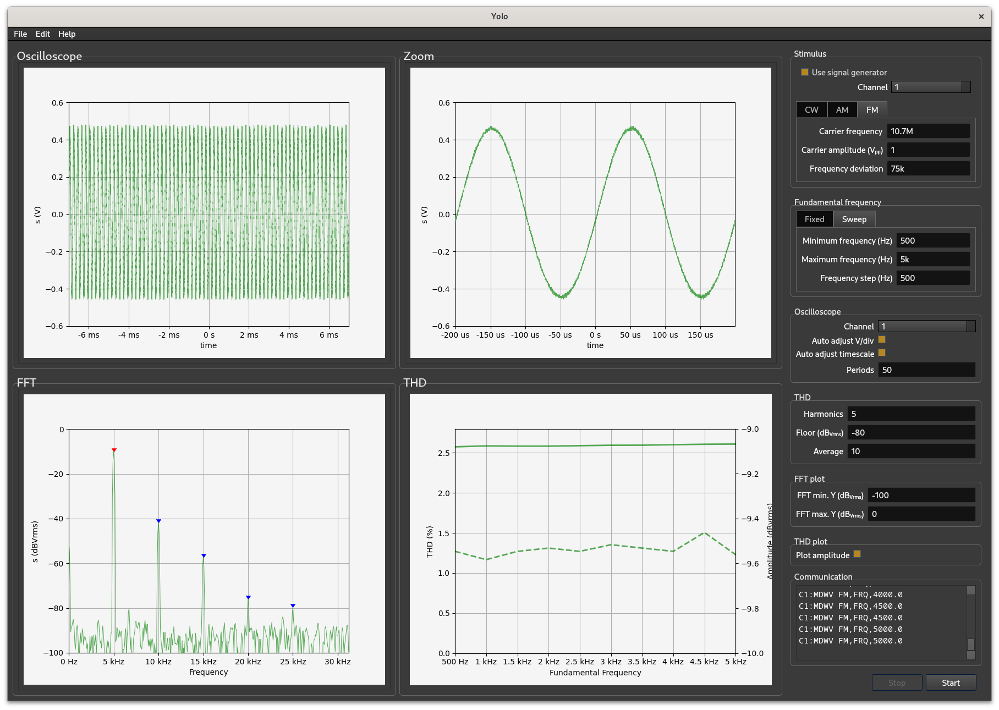

# Yolo
## Automated distortion analysis using a signal generator and oscilloscope


### Fixed frequency operation
This shows a fixed frequency CW tone from the signal generator being analyzed:




<br>
<br>


This shows a FM signal (carrier frequency = 10.7MHz, fixed modulation frequency 1kHz, frequency deviation = 75kHz) which is fed to a FM demodulator and analyzed with yolo:

<br>
<br>


### Swept frequency operation
This shows a swept frequency (from 1MHz to 10MHz) CW tone being analyzed:


<br>
<br>


This shows a FM signal (carrier frequency = 10.7MHz, modulation frequency sweep from 500Hz to 5kHz, frequency deviation = 75kHz) which is fed to a FM demodulator and analyzed with yolo:

<br>
<br>

## Usage

### On linux:

From the directory in which `yolo.py` was installed:
```
python3 -m yolo.py
```

### On macOS:

### On Windows:

### On first use

On first use the ip-addresses of the oscilloscope and the signal generator needs to be entered. This can be done in the Settings dialog:


The data in this dialog will be saved in `/home/<user>/.config/FM Homelab/yolo.conf`


### Use without signal generator


## Tested with

- Fedora Linux 39
- Gnome 45.10
- Linux 6.11.9-100.fc39.x86_64
- oscilloscope: Siglent SDS1202X-E
- signal generator: Siglent SDG1032X
- python 3.11.11


## Requirements
engineering-notation 0.10.0
<br>
fft_calculations     0.2.2
<br>
matplotlib           3.10.0
<br>
matplotlib-inline    0.1.6
<br>
numpy                2.2.2
<br>
pydatacq             0.4.5
<br>
PyQt6                6.8.0
<br>
PyQt6-Qt6            6.8.1
<br>
PyQt6_sip            13.9.1
<br>
PySide6              6.8.1.1
<br>
PySide6_Addons       6.8.1.1
<br>
PySide6_Essentials   6.8.1.1
<br>
PyVISA               1.14.1
<br>
PyVISA-py            0.7.2
<br>
qasync               0.27.1
<br>
quantiphy            2.20
<br>
scipy                1.15.1
<br>
uvloop               0.19.0a1
<br>
<br>

## pyvisa vs. pydatacq

To circumvent some peculiarities in the SCPI over TCP implementation in the Siglent SDG1032X signal generator special code was written in the pydatacq package. This package communicates with the SDG1032X and SDS1202X-E.

Normal read/write communication with the SDG1032X and SDS1202X-E is done with python's asyncio package. This packages communicates in plain TCP with the devices. On the SDG1032X this leads to long required wait times of 0.5 seconds between writes to the device. If the waits are omitted the SDG1032X will hang. To circumvent this, the SDG1032X can also be programmed in SCPI over PyVisa. The PyVisa package communicates SCPI over VXI-11 over TCP which does not require long waits between writes. Communication with the SDG1032X will be much faster.

It is unknown how this works on other signal generators than the SDG1032X.


## More to do

- make engine a class
- set sample memory as low as needed
- clean up code
- document code
- prepare for oscilloscopes with more than 2 channels
- export THD plot to file
- export THD and Amplitude vs. frequency data to file in csv format
- sweep amplitude (this will require a major rework of the gui as well)
- label both y-axes in THD plot with lines equal as in the plot
- make last used measurement settings persistent across sessions


 


